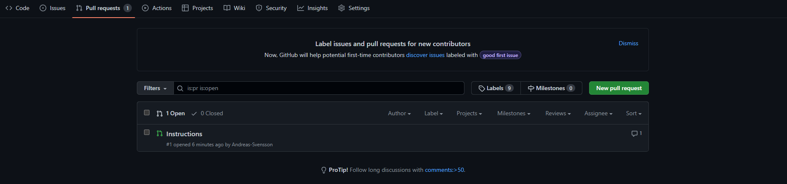

# git-branches

Vi lägger till första raden och committar

## instruction branch

Nu skapar vi en branch som heter instructions. Detta gör vi mha kommandot

```md
git checkout -b instructions
```

För att pusha upp ändringar till denna branch behöver vi först stagea, committa, och pusha  
För push till denna branch gör vi

```md
git push origin instructions
```

För att checka branches vi har:

```md
git branch
```

## pull requests

För att få mergea in ändringar från denna branch in till main öppnar vi en pull request. Detta gör vi i fliken pull request.



---
## merge

Efter pull request är det viktigt att varje person kör en pull till sin main branch och pull till sin egna branch
